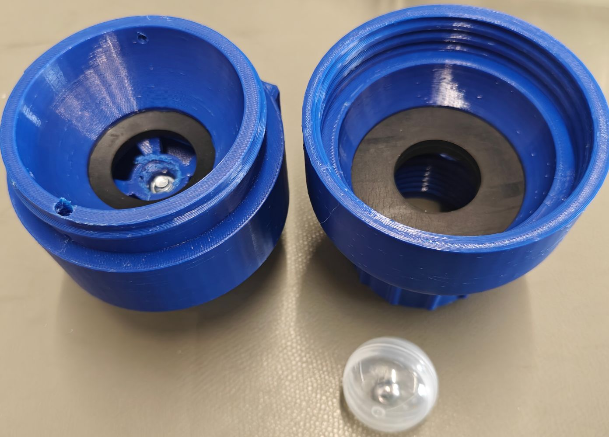
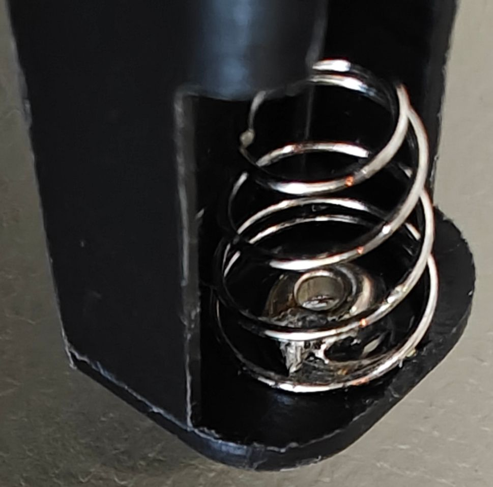
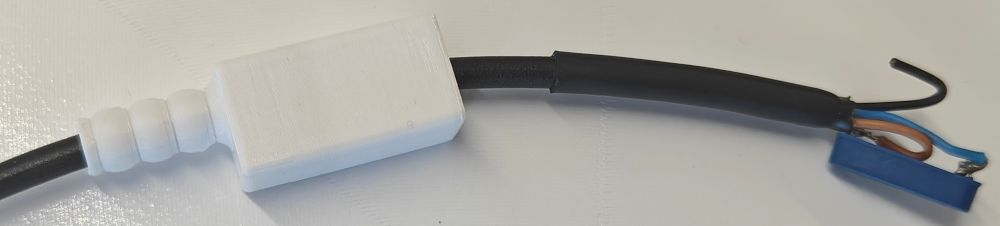
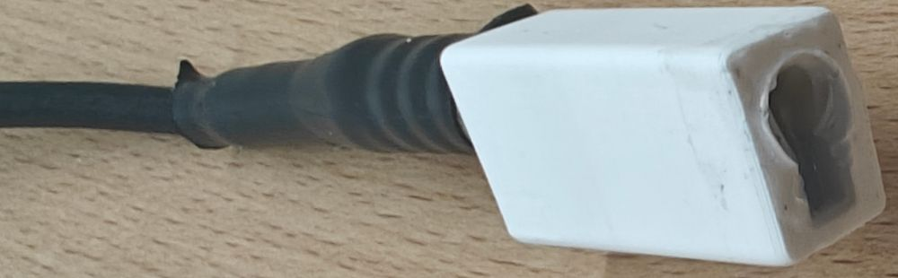
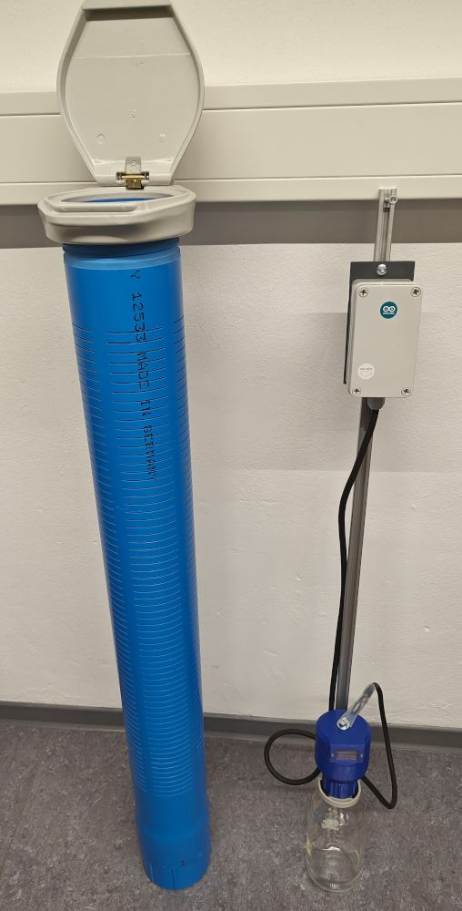

```{=html}
<div class="title-slide">
  <div class="ts-logo">
    
  </div>
  <div class="ts-photo">
    
  </div>
  <div class="ts-text">
    <h1>IoT Monitoring Solution for Event-Based Water Sample Collection — Lessons Learnt</h1>
  </div>
  <div class="ts-meta">
    <div class="meta-name">Stefan Helmert et al.</div>
    <div class="meta-faculty">Faculty of Informatics / Mathematics, HTW Dresden</div>
    <div class="meta-date">23.09.2026</div>
  </div>
</div>
```

---

## Talk map

**10–15 min talk + 10 min Q&A**

::: {.incremental}
- 1 min — Why this matters
- 4 min — What we built: retrofit LoRaWAN notifier
- 7 min — What broke / surprised us: 4 lessons
- 2 min — What we'd recommend for OSH
- 10 min — Discussion with you
:::

::: {.notes}
Total ~14 min. Keep motivation short, spend most time on lessons 1–4. End with explicit invitation for Q&A.
:::

---

## Why event-based sampling?

::: columns
::: {.column width="52%"}
**EU Water Framework Directive 2000/60/EG**

- EU framework for water policy — all surface waters must reach **good ecological & chemical status** (2015, exceptions to 2027)
- Compliance requires systematic monitoring of priority substances — in water, sediments and biota
- Floods & heavy rain mobilize runoff pollutants: heavy metals, pesticides, microplastics, pathogens
- Sample must reach the laboratory **within 48 h**

::: {style="font-size: 0.65em; color: grey;"}
Source: [Richtlinie 2000/60/EG (Wasserrahmenrichtlinie)](https://de.wikipedia.org/wiki/Richtlinie_2000/60/EG_%28Wasserrahmenrichtlinie%29)
:::
:::
::: {.column width="48%"}
**Why a passive water sampler?**

- Event peaks are **short and unpredictable** — grab sampling and on-call staff miss them
- Miss the event = miss the data
- Passive sampler: permanently installed at a fixed inlet elevation, fully automatic
- Fills only when the river stage exceeds the inlet → **event-based by design**
- Unattended, low-cost, open source → suited for long-term monitoring
:::
:::

::: {.notes}
1.5 min. WFD sets the legal duty (good status, systematic monitoring incl. priority substances). The passive sampler is the right tool because the event timing is unpredictable — it captures the peak automatically, unattended.
:::

---

## The passive water sampler

::: columns
::: {.column width="50%"}
**Existing, open-source design (HTW Dresden):**

- Installed at a fixed inlet elevation in the river
- Fills automatically when the river stage exceeds the inlet
- Float + magnet valve closes when the bottle is full
- Works unattended — but silent

**The problem:**

- ❌ No notification when a sample is taken
- ❌ Staff drive out to check — often find it **empty**
- ❌ Labour-intensive; the 48 h window is easily missed
:::
::: {.column width="50%"}
{fig-align="center"}

::: {style="font-size: 0.7em; color: grey;"}
Opened valve head. Bottom: float ball with magnet. Top: fixed magnet — closes valve when full.
:::
:::
:::

::: {.notes}
1.5 min. The sampler itself works well — the missing piece is information: WHEN was the sample taken?
:::

---

## The IoT extension: retrofit notifier

**Guiding principle: minimize complexity — no modification to the sampler.**

```{mermaid}
flowchart LR
  A[River level rises<br/>Sampler fills<br/>Valve closes] --> B[Reed switch<br/>detects magnet]
  B --> C[Arduino MKR WAN 1310<br/>cold-boots]
  C --> D[LoRaWAN → TTN]
  D --> E[Python MQTT gateway]
  E --> F[Email via SMTP<br/>📱 Staff notified]
```

- Reed switch senses valve magnet **through the head wall**
- LoRaWAN to The Things Network (low data, long range, no SIM)
- Server: Python + Eclipse Paho MQTT → SMTP email
- **No app, no dashboard, no database** — 4 env vars

::: {.notes}
1.5 min. Emphasize retrofit: plug + flexible cable, mount/dismount by hand in the field.
:::

---

## Design for years without power

::: columns
::: {.column width="55%"}
- **Battery:** Tadiran SL-360 Li-SOCl₂, 3.6 V / 2.4 Ah
  - replaceable by user, low self-discharge
- **Standby < 10 µA:**
  - 3.3 V LDO **disabled** between events
  - Only MCP7940 RTC + wake circuit alive (~2 µA)
  - Arduino **fully off** — cold boot every wake
- **Wake sources:**
  - Reed pulse (sample taken) via RC shaper
  - RTC alarm every ~1.5 h (keep-alive)
- 2× supercaps buffer LoRa TX bursts
- Protection: reverse polarity, overvoltage, series R on all I/O
:::
::: {.column width="45%"}
{fig-align="center"}

::: {style="font-size: 0.7em; color: grey;"}
Open IP67 enclosure with assembled IoT module.
:::
:::
:::

::: {.notes}
1.5 min. Point: not sleep mode — true power gating. RTC MFP pin holds regulator enable.
:::

---

## Open-source throughout

::: columns
::: {.column width="50%"}
**Hardware & mechanics**

- KiCad PCB (1-sided, SMD, pre-assemblable)
- Arduino MKR WAN 1310 as module → no custom radio
- Parametric CAD with `xyzcad` (Python) — no GUI CAD needed
- PETG printed parts, IP67 box + glands
- I²C + analog ports exposed for future sensors

**Replicate with:** soldering iron, FDM printer, drill, heat gun
:::
::: {.column width="50%"}
**Software & licences**

- Firmware: Arduino IDE
- Server: Python, Git, Linux
- PCB → firmware → server: **only OSS tools**
- Licences: **AGPL-3.0 + CERN-OHL-S-2.0**
- Repo: `HTWWaterSampleCollector2026`
:::
:::

::: {.notes}
1 min. oSHOP angle: long-term spare parts, no proprietary interfaces, low barrier.
:::

---

## Lesson 1: Coverage — not standby — kills the battery

- Lab thinking: optimize standby → <10 µA ✔
- Field reality: **LoRaWAN retries dominate**
  - Indoor / ground level: RSSI −118…−134 dBm, sometimes no gateway at all (e.g. OHS Berlin demo)
  - Join succeeds at SF12, then ADR switches uplink to **SF9** (TTN default "recommended") — which **never arrives** at these RSSI levels
  - 5× retry cycle ≈ **15 mAh/day** — 10–15× normal
- Why: link budget + TTN Fair Access Policy (30 s/day, 1.4 s per SF12 join) + downlink margin
- **Fixes that saved us:** hard retry limit + register/configure the device with **SF12, not TTN "recommended" SF9**

::: {.callout-important}
## Takeaway
Design the energy budget for **worst-case connectivity**, not best-case sleep current.
:::

::: {.notes}
2 min. This is the core surprise: 6 months testing showed connectivity, not standby, depletes battery. TTN console gives no downlink metadata — debugging is blind. Practical tip: TTN suggests SF9 as recommended data rate at registration — override it with SF12 for marginal links, otherwise ADR pushes the uplink out of the link budget right after a successful SF12 join.
:::

---

## Lesson 2: Cold boot is a feature

::: {.incremental}
- Every wake = full power-on + fresh OTAA join
- **Never hung.** No LoRa lock-up, no watchdog needed.
- Moved Dresden → Berlin (OHS2026): joined local gateway **autonomously**, zero reconfiguration
- A session-preserving sleep design would have needed a hard reset
- Cost: ~2 s bootloader + Arduino init per wake — irrelevant for event-driven use
- Limitation: LoRaWAN gives **no network time** → RTC drifts, re-sync only via USB
:::

::: {.callout-tip}
## Takeaway
For rare-event devices, **stateless cold boot beats elegant power management.**
:::

::: {.notes}
1.5 min. Counter-intuitive: the 'dumb' solution is the robust one.
:::

---

## Lesson 3: Small parts, big delays

| Part | What happened | Fix |
|---|---|---|
| **SAMD21 POR** | Supercaps ramp < 1 V/ms → POR never fires → undefined boot, manual reset needed | Add MAX809 supervisor next rev |
| **MCP7940 crystal** | Common CC4V-T1A (2.1 fF) doesn't oscillate; needs high motional C + <70 kΩ ESR — **not in datasheet** | CM7V-T1A from compatibility list |
| **MCP7940 backup** | MFP pin behaviour on VBAT differs from datasheet; undocumented | Tolerated — cold-boot design absorbs it |
| **Battery holder** | Intermittent spring↔tab contact | Solder bridge + shorten standoff |

{height="180px" fig-align="center"}

::: {style="font-size: 0.7em; color: grey; text-align: center;"}
Battery holder fix: solder spring to rivet.
:::

::: {.notes}
1.5 min. Pattern: information gaps, not design errors, cost weeks. MKRWAN TTN examples were the positive exception — OTAA worked copy-paste.
:::

---

## Lesson 4: Mechanics & materials > electronics

::: columns
::: {.column width="50%"}
{fig-align="center"}

::: {style="font-size: 0.7em; color: grey;"}
Reed + cable before potting into PETG case.
:::
:::
::: {.column width="50%"}
{fig-align="center"}

::: {style="font-size: 0.7em; color: grey;"}
Potted with hot-glue, heat-shrink with adhesive liner.
:::
:::
:::

::: {.incremental}
- Valve head v1: trapped air → bottle didn't fill → vent hole added
- 2nd fixed magnet disturbed reed → orthogonal orientation + head redesign
- Cable: stranded core wicks water (capillary!), jacket (TPE-V / EPDM-PP) low surface energy → glue won't stick — **never in datasheets**
- SolidWorks handover → data loss, rework from exports
:::

::: {.callout-important}
## Takeaway
Interdisciplinary gaps (mechanics, material science) are the biggest OSH risk.
:::

::: {.notes}
2 min. Electronics team underestimated wet, UV, 2-day submersion requirements.
:::

---

## Conclusion: 3 recommendations

1. **Build the MVP, gate the power.** Cold boot + email-only backend survived everything. Complexity is a failure point.
2. **Budget for the worst link, demand better docs.** Retry caps; ask vendors for motional C, surface energy, downlink debug — datasheets + TTN console are incomplete.
3. **Document mechanics like code.** Parametric CAD + step-by-step build log; plan for SolidWorks handover loss and material incompatibility.

::: {.callout-note}
## Open hardware, honestly
All files (KiCad, xyzcad, firmware, server) published — including the failures above — under AGPL-3.0 / CERN-OHL-S-2.0.
:::

::: {style="font-size: 0.8em; color: grey; display: flex; align-items: center; gap: 1em; margin-top: 0.5em;"}

<span>**Funded by VolkswagenStiftung** · Grant 9C858 · Full paper in oSHOP 2026 proceedings (Qucosa).</span>
:::

::: {.notes}
1.5 min. Bridge to discussion: ideals vs. deployment reality.
:::

---

## Thank you — Discussion

::: columns
::: {.column width="60%"}
**Repo & contact:** HTW Dresden, Smart Production Systems + Water Management\
`github.com / HTWWaterSampleCollector2026`\
stefan.helmert@htw-dresden.de

**Questions to you (10 min Q&A):**

- How do you test LoRaWAN where *you* deploy — coverage mapping?
- Cold boot vs. sleep + ABP/session persist — what worked for you?
- Which cable/potting/adhesive pairs survived years outdoors?
- What belongs in a "well-behaved parts library" for environmental OSH?
:::
::: {.column width="40%"}
{fig-align="center"}

::: {style="font-size: 0.7em; color: grey;"}
Ready for field test — notification included.
:::
:::
:::

::: {.notes}
Invite show-and-tell: module + valve head on table. Ask audience for material tips — crowdsource the parts library idea from conclusion.
:::

---

## Backup: numbers at a glance

- Standby: <10 µA @ 3.6 V (RTC <2 µA, reed leakage <5 µA)
- Battery: 2.4 Ah Li-SOCl₂ + 2× supercaps
- Keep-alive: RTC alarm 1.5 h
- Retries: 5× join+send, then stop (15 mAh/day worst case)
- Boot: ~2 s to first app line (bootloader + core)
- Enclosure: IP67, ether-TPU / EPDM-PP cable, PETG mounts
- Server: Paho MQTT → SMTP/STARTTLS, 4 env vars

::: {.notes}
Only show if asked about dimensions, power, or server setup.
:::

```{=html}
<script>
// Add HTWD footer to all slides except title slide
(function() {
  function addFooter() {
    var slides = document.querySelectorAll('.reveal .slides > section');
    slides.forEach(function(slide, index) {
      if (index === 0) return; // skip title slide
      if (slide.querySelector('.footer-bar')) return;
      var footer = document.createElement('div');
      footer.className = 'footer-bar';
      footer.innerHTML =
        '' +
        '<span class="footer-date">23.09.2026</span>' +
        '<span class="footer-title">IoT monitoring solution for event based water sample collection · Faculty of Informatics / Mathematics · Stefan Helmert et al.</span>' +
        '<span class="footer-slide">' + (index + 1) + '</span>';
      slide.appendChild(footer);
    });
  }
  if (document.readyState === 'loading') {
    document.addEventListener('DOMContentLoaded', addFooter);
  } else {
    addFooter();
  }
})();
</script>
```
