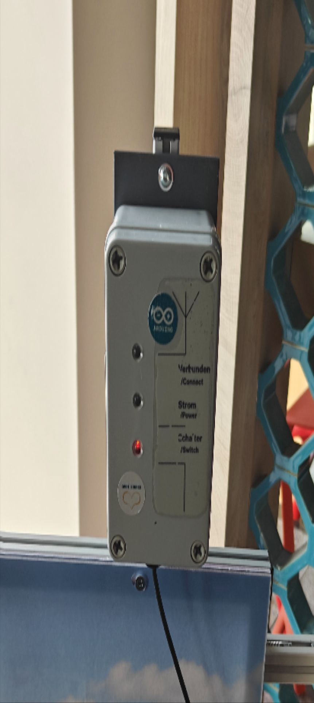
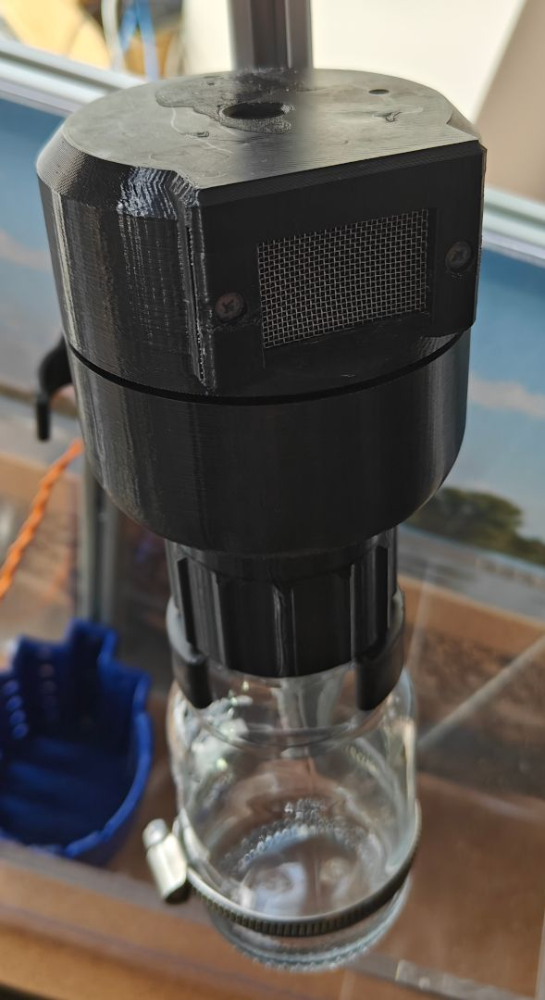
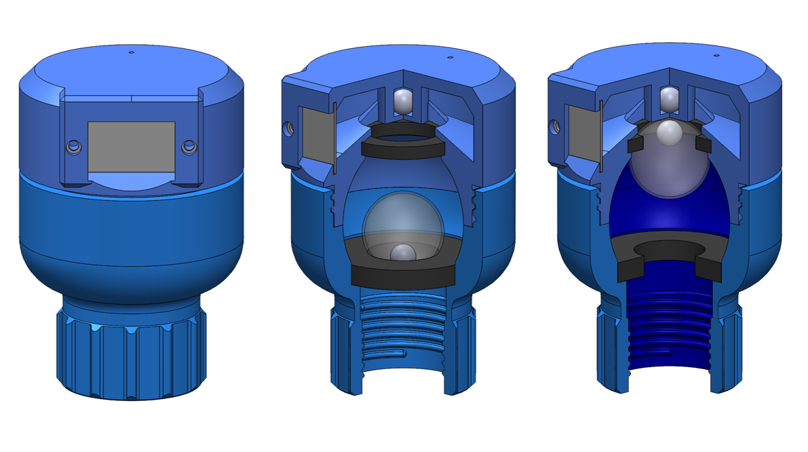
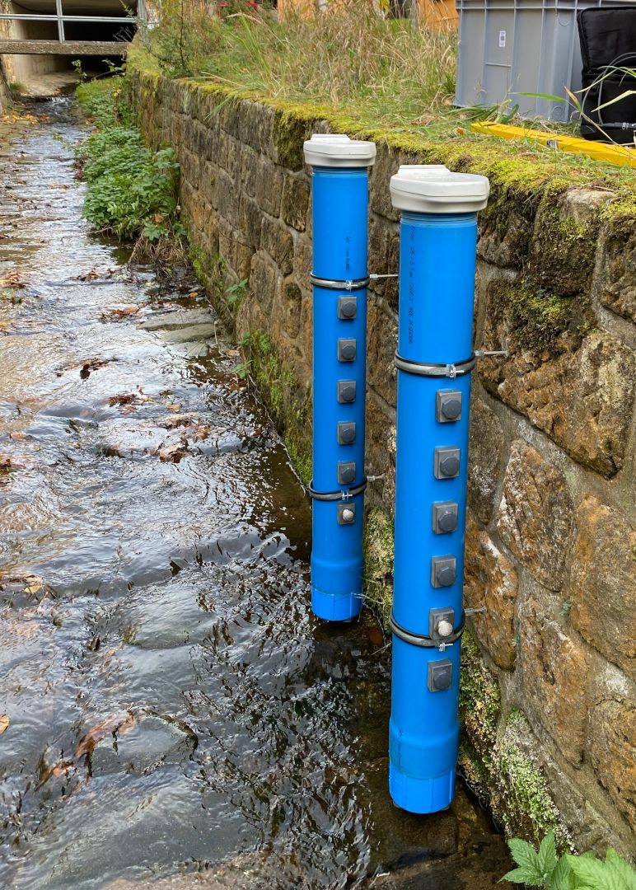
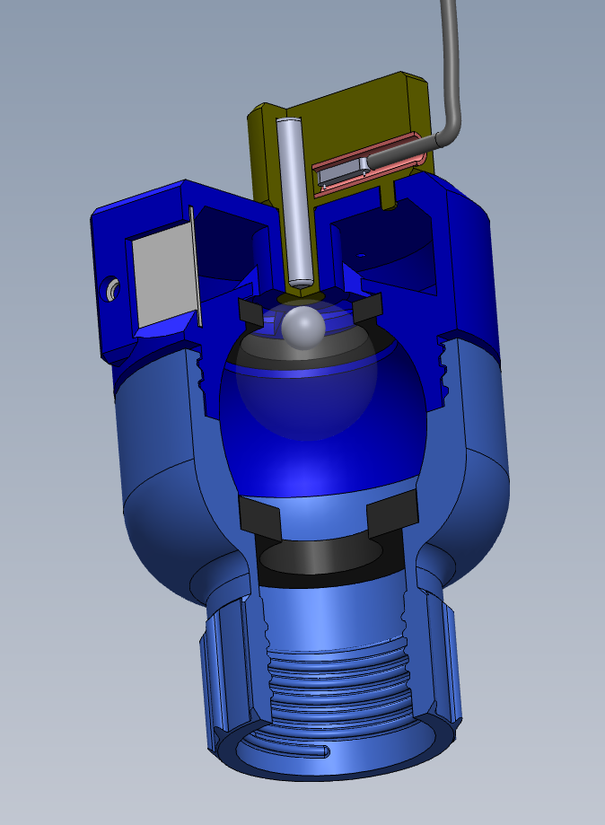
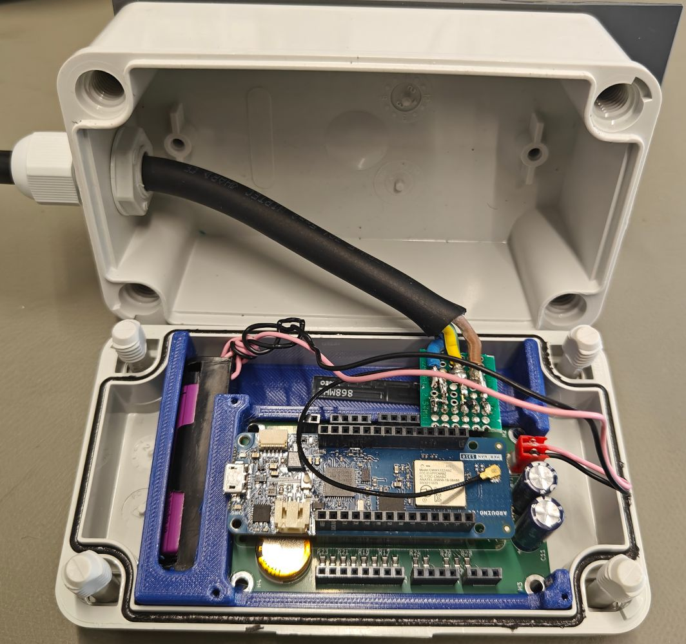
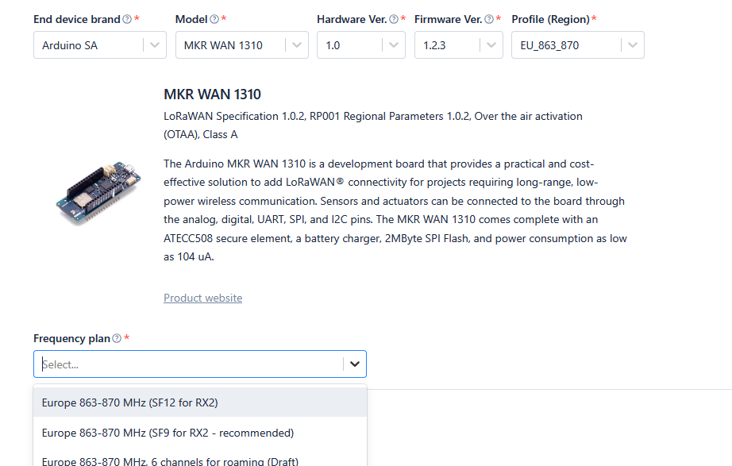
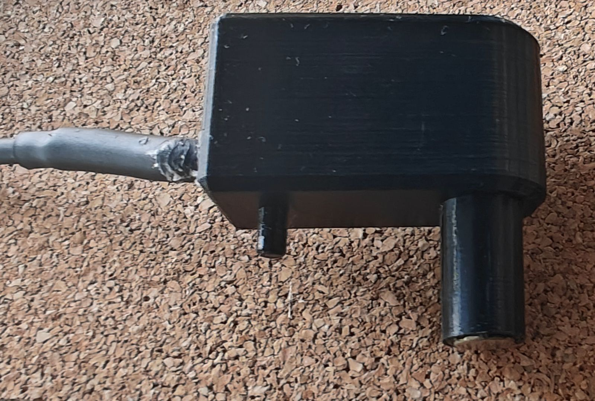
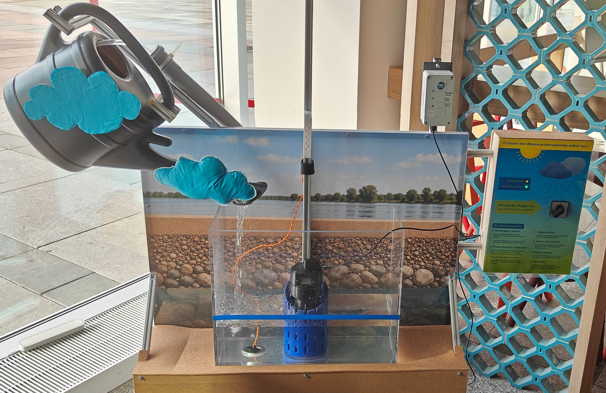

```{=html}
<div class="title-slide">
  <div class="ts-logo">
    
  </div>
  <div class="ts-photo">
    
  </div>
  <div class="ts-text">
    <h1>IoT Monitoring Solution for Event-Based Water Sample Collection — Lessons Learnt</h1>
  </div>
  <div class="ts-meta">
    <div class="meta-name">Stefan Helmert et al.</div>
    <div class="meta-faculty">Faculty of Informatics / Mathematics, HTW Dresden</div>
    <div class="meta-date">23.09.2026</div>
  </div>
</div>
```

---

## Talk map

**10–15 min talk + 10 min Q&A**

::: {.incremental}
- 1 min — Why this matters
- 4 min — What we built: retrofit LoRaWAN notifier
- 7 min — What broke / surprised us: 4 lessons
- 2 min — What we'd recommend for OSH
- 10 min — Discussion with you
:::

::: {.notes}
Total ~14 min. Keep motivation short, spend most time on lessons 1–4. End with explicit invitation for Q&A.
:::

---

## Why event-based sampling?

::: columns
::: {.column width="62%"}
- **EU Water Framework Directive 2000/60/EG:** all waters must reach good ecological & chemical status → pollutants must be monitored
- Floods mobilize pollutants (heavy metals, pesticides, microplastics) — peaks are short & unpredictable, sample → lab **within 48 h**
- **Passive sampler solves this:** permanently installed, fills automatically once the water level exceeds a defined inlet elevation — event-based by design, unattended, low-cost
- Once filled, a **passive magnetic valve** closes the bottle to prevent washout of the sample

::: {style="font-size: 0.65em; color: grey;"}
Source: [Richtlinie 2000/60/EG (Wasserrahmenrichtlinie)](https://de.wikipedia.org/wiki/Richtlinie_2000/60/EG_%28Wasserrahmenrichtlinie%29)
:::
:::
::: {.column width="38%"}

:::
:::

::: {.notes}
1 min. WFD sets the legal duty (good status, systematic monitoring). The passive sampler is the right tool because the event timing is unpredictable — it captures the peak automatically, unattended. Details if asked: compliance monitored in water, sediments, biota; deadline 2015, exceptions to 2027.
:::

---

## The passive water sampler

::: columns
::: {.column width="58%"}
**Problem: no notification**

1. Staff drive out to check — often
2. The **48 h window** is easily missed


:::
::: {.column width="42%"}

:::
:::

::: {.notes}
1 min. The sampler itself works (previous slide) — the missing piece is information: WHEN was the sample taken? This is exactly what the IoT module provides.
:::

---

## The IoT extension

::: columns
::: {.column width="60%"}
**Design goal: minimize complexity — no modification to the original passive sampler.** *(But nope.)*

1. River level rises — sampler fills, magnetic valve closes
2. Reed switch senses the valve magnet **through the head wall**
3. Arduino MKR WAN 1310 cold-boots
4. LoRaWAN → The Things Network (low data, long range, no SIM)
5. Python MQTT gateway → SMTP email to staff — **no app, no dashboard, no database** (4 env vars)
:::
::: {.column width="40%"}

:::
:::

::: {.notes}
1.5 min. Walk the chain verbally: level rises → valve closes → reed switch → cold boot → LoRaWAN/TTN → Python gateway → email. Emphasize retrofit: plug + flexible cable, mount/dismount by hand in the field. Render shows the retrofitted valve head.
:::

---

## Design for years without power

::: columns
::: {.column width="55%"}
- **Battery:** Tadiran SL-360 Li-SOCl₂, 3.6 V / 2.4 Ah
  - replaceable by user, low self-discharge
- **Standby < 10 µA:**
  - 3.3 V LDO **disabled** between events
  - Only MCP7940 RTC + wake circuit alive (~2 µA)
  - Arduino **fully off** — cold boot every wake
- **Wake sources:**
  - Reed pulse (sample taken) via RC shaper
  - RTC alarm every ~1.5 h (keep-alive)
- 2× supercaps buffer LoRa TX bursts
- Protection: reverse polarity, overvoltage, series R on all I/O
:::
::: {.column width="45%"}
{fig-align="center"}

::: {style="font-size: 0.7em; color: grey;"}
Open IP67 enclosure with assembled IoT module.
:::
:::
:::

::: {.notes}
1.5 min. Point: not sleep mode — true power gating. RTC MFP pin holds regulator enable.
:::

---

## Open-source throughout

::: columns
::: {.column width="50%"}
**Hardware & mechanics**

- KiCad PCB (1-sided, SMD, pre-assemblable)
- Arduino MKR WAN 1310 as module → no custom radio
- Parametric CAD with `xyzcad` (Python) — no GUI CAD needed [@11633154]
- PETG printed parts, IP67 box + glands
- I²C + analog ports exposed for future sensors

**Replicate with:** soldering iron, FDM printer, drill, heat gun
:::
::: {.column width="50%"}
**Software & licences**

- Firmware: Arduino IDE
- Server: Python, Git, Linux
- PCB → firmware → server: **only OSS tools**
- Licences: **AGPL-3.0 + CERN-OHL-S-2.0**
- Repo: `TheTesla/HTW-Water-Sample-Collector`
:::
:::

::: {.notes}
1 min. oSHOP angle: long-term spare parts, no proprietary interfaces, low barrier.
:::

---

## Lesson 1: Coverage kills the battery

::: columns
::: {.column width="48%"}
- Lab thinking: standby <10 µA ✔
- Field reality: **LoRaWAN retries dominate**
  - 20 mA for 60 s per retry cycle
  - 4 retry cycles ≈ **21 mAh/day** (16 status messages/day, every 90 min)

::: {style="margin-left: 2em;"}
**→ battery empty after 3–4 months**

**→ Optimize for robustness: SF12 for robust short messages**
:::
:::
::: {.column width="52%"}
{fig-align="center"}
:::
:::

::: {.notes}
2 min. Core surprise: 6 months testing showed connectivity, not standby, depletes battery. 20 mA @ 60 s per retry cycle; hard retry limit + register device with SF12, not TTN "recommended" SF9. TTN console gives no downlink metadata — debugging is blind.
:::

---

## Lesson 2: Cold boot is a feature

- Every wake = full power-on + fresh OTAA join
- **Never hung.** No LoRa lock-up, no watchdog needed.
- Moved Dresden → Berlin (OHS2026): joined local gateway **autonomously**, zero reconfiguration
- A session-preserving sleep design would have needed a hard reset
- Cost: ~2 s bootloader + Arduino init per wake — irrelevant for event-driven use
- Limitation: LoRaWAN gives **no network time** → RTC drifts, re-sync only via USB

::: {.callout-tip}
## Takeaway
For rare-event devices, **stateless cold boot beats elegant power management.**
:::

::: {.notes}
1.5 min. Counter-intuitive: the 'dumb' solution is the robust one.
:::

---

## Lesson 3: Errors and unknowns

| Part | What happened | Fix |
|---|---|---|
| **SAMD21 POR** | Supercaps ramp < 1 V/ms → POR never fires → undefined boot, manual reset needed | Add MAX809 supervisor next rev |
| **MCP7940 crystal** | Common CC4V-T1A (2.1 fF) doesn't oscillate; needs high motional C + <70 kΩ ESR — **not in datasheet** | CM7V-T1A from compatibility list |
| **MCP7940 backup** | MFP pin behaviour on VBAT differs from datasheet; undocumented | Tolerated — default behaviour + cold-boot design absorb it |
| **Battery holder** | Intermittent spring↔tab contact | Solder bridge + shorten standoff |

::: {.notes}
1.5 min. Pattern: information gaps, not design errors, cost weeks. MKRWAN TTN examples were the positive exception — OTAA worked copy-paste.
:::

---

## Lesson 4: Real-world problems

::: {style="font-size: 0.8em; color: grey;"}
Mechanics & materials > electronics
:::

::: columns
::: {.column width="55%"}
- Valve head v1: trapped air → bottle didn't fill → vent hole added
- 2nd fixed magnet disturbed reed → orthogonal orientation + head redesign
- Cable: stranded core wicks water (capillary!), jacket (TPE-V / EPDM-PP) low surface energy → glue won't stick — **never in datasheets**
- Missing design resources
:::
::: {.column width="45%"}
{fig-align="center" width="90%"}
:::
:::

::: {.callout-important}
## Takeaway
Interdisciplinary gaps (mechanics, material science) are the biggest OSH risk.
:::

::: {.notes}
2 min. Electronics team underestimated wet, UV, 2-day submersion requirements.
:::

---

## Conclusion: 3 recommendations

1. **Analyze, test, validate, document, repair** the status quo.
2. **Optimize the MVP** for minimum complexity and maximum robustness.
3. **Minimize the requirements** for involved people.

::: {.callout-note}
## Open hardware, honestly
All files (KiCad, xyzcad, firmware, server) published — including the failures above — under AGPL-3.0 / CERN-OHL-S-2.0.
:::

::: {.notes}
1.5 min. Bridge to discussion: ideals vs. deployment reality.
:::

---

## Thank you — Discussion {.footer-safe}

::: columns
::: {.column width="60%"}
**Repo & contact:** HTW Dresden, Smart Production Systems + Water Management\
<https://github.com/TheTesla/HTW-Water-Sample-Collector>\
stefan.helmert@htw-dresden.de
:::
::: {.column width="40%"}
{fig-align="center"}

::: {style="font-size: 0.7em; color: grey;"}
Demonstration at COSMO Wissenschaftsforum in Dresden.
:::
:::
:::

::: {style="font-size: 0.8em; color: grey; display: flex; flex-direction: column; align-items: center; gap: 0.6em; margin-top: 2.5em; margin-bottom: 1.5em;"}


<span>**Funded by VolkswagenStiftung** · Grant 9C858 · Full paper in oSHOP 2026 proceedings (Qucosa).</span>
:::

::: {.notes}
Invite show-and-tell: module + valve head on table. Ask audience for material tips — crowdsource the parts library idea from conclusion.
:::

---

## References

::: {style="font-size: 0.75em;"}
::: {#refs}
:::
:::

---

## Backup: numbers at a glance

- Standby: <10 µA @ 3.6 V (RTC <2 µA, reed leakage <5 µA)
- Battery: 2.4 Ah Li-SOCl₂ + 2× supercaps
- Keep-alive: RTC alarm 1.5 h
- Retries: 4 retry cycles, then stop (21 mAh/day worst case)
- Boot: ~2 s to first app line (bootloader + core)
- Enclosure: IP67, ether-TPU / EPDM-PP cable, PETG mounts
- Server: Paho MQTT → SMTP/STARTTLS, 4 env vars

::: {.notes}
Only show if asked about dimensions, power, or server setup.
:::

```{=html}
<script>
// Add HTWD footer to all slides except title slide
(function() {
  function addFooter() {
    var slides = document.querySelectorAll('.reveal .slides > section');
    slides.forEach(function(slide, index) {
      if (index === 0) return; // skip title slide
      if (slide.querySelector('.footer-bar')) return;
      var footer = document.createElement('div');
      footer.className = 'footer-bar';
      footer.innerHTML =
        '' +
        '<span class="footer-date">23.09.2026</span>' +
        '<span class="footer-title">IoT monitoring solution for event based water sample collection · Faculty of Informatics / Mathematics · Stefan Helmert et al.</span>' +
        '<span class="footer-slide">' + (index + 1) + '</span>';
      slide.appendChild(footer);
    });
  }
  if (document.readyState === 'loading') {
    document.addEventListener('DOMContentLoaded', addFooter);
  } else {
    addFooter();
  }
})();
</script>
```
